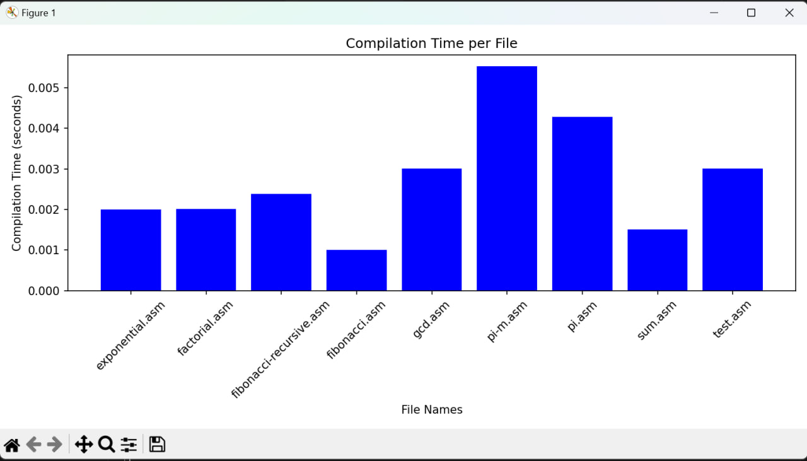

# Requirements:

```python
pip install matplotlib
```

# Project Overview:
This project is MIPS microprocessor simulation, which converts assembly language code into binary and decimal formats. The micrprocessor is divided in several modules:
- PC (Program Counter): Holds the address of the instruction to be executed next.
- Instruction Memory: Stores the instructions to be executed.
- Register Bank: Contains the registers that temporarily hold data during execution.
- ALU (Arithmetic Logic Unit): Performs arithmetic and logical operations.
- Control Unit: Directs the operation of the processor.
- Data Memory: Stores data used and produced by the program.

The MIPS microprocessor simulator is capable of handling various instruction types including:
- R-Type: Basic arithmetic operations like addition, subtraction, etc.
- I-Type: Immediate arithmetic operations and data transfer instructions.
- IO: Input and output operations.
- Branch: Conditional and unconditional branch operations.
- Jump: Direct jump instructions to alter the flow of execution.

| Type   | Instruction | Opcode |
|--------|-------------|--------|
| R-Type | add         | 0      |
|        | sub         | 0      |
|        | mult        | 0      |
|        | div         | 0      |
|        | mod         | 0      |
|        | and         | 0      |
|        | or          | 0      |
|        | slt         | 0      |
| I-Type | addi        | 16     |
|        | subi        | 17     |
|        | multi       | 18     |
|        | divi        | 19     |
|        | modi        | 20     |
|        | andi        | 21     |
|        | ori         | 22     |
|        | slti        | 23     |
| IO     | lw          | 35     |
|        | sw          | 43     |
| Branch | beq         | 4      |
| Jump   | j           | 2      |
|        | jr          | 8      |


The project contains more Assembly language programs, such as exponential, factorial, greatest common divisor, Fibonacci, estimation of pi, etc.

The primary goal is to process assembly files, compile them into machine-readable formats, and analyze the efficiency of the compilation process by plotting the time taken for each file's compilation.

I used a barchart to display the perfomance:


